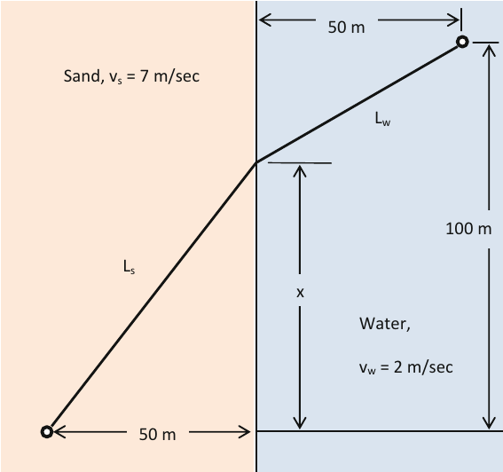

# Optimization: single-variable problems

single-variable exercises from the book "Optimization Fundamentals (2018, Springer)".

## The lifeguard problem

Find a path to the swimmer that minimizes time, see the following figure. The objective function is time, and the
design variable is x, the point at which the lifeguard enters the water.

The objective function must be written as a function of the design variable. First, the total time is the sum of
the times that take the lifeguard to go over the sand and water:

$t = t_s + t_w$

where $t$ is the total time, and $t_s,\\,t_w$ are the times over the sand and water, respectively.

