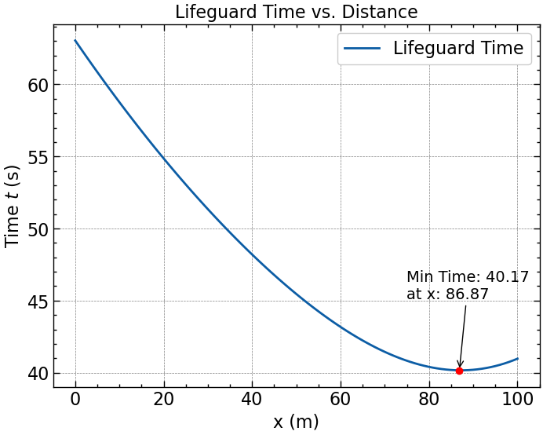

# Optimization: single-variable problems

single-variable exercises from the book "Optimization Fundamentals (2018, Springer)".

## 1. The lifeguard problem

Find a path to the swimmer that minimizes time, see Figure 1. The objective function is time, and the
design variable is x, the point at which the lifeguard enters the water.

<figure>
    
    <figcaption>Figure 1. The lifeguard problem.</figcaption>
     
</figure>

 

The objective function must be written as a function of the design variable. First, the total time is the sum of
the times that take the lifeguard to go over the sand and water:

$$t = t_s + t_w = \displaystyle \frac{L_s}{v_s} + \displaystyle \frac{L_w}{v_w}$$

where $t$ is the total time, and $t_s,\\,t_w$ are the times over the sand and water, respectively. $L_s,\\, L_w$ are
the straight line lengths over the sand and water, respectively. $v_s,\\, v_w$ are the velocities of the lifeguard
over the sand and water, respectively.

Then, using the Pythogorean theorem, we can find the straight line lengths. Then, the objective function is:

$$t(x) = \displaystyle \frac{1}{7}\sqrt{50^2+x^2} + \displaystyle \frac{1}{2}\sqrt{50^2+(100-x)^2}$$

The optimum solution, meaning the minimum time, can be easily found looking for the plot's minimum coordinates.

<figure>
    
    <figcaption>Figure 2. Time as a function of x.</figcaption>
     
</figure>

 

# 2. Maximum Range of a Projectile with Aerodynamics

Let’s consider a tennis ball with a diameter of 65 mm and a mass of 57 g .Since the ball can move in both
horizontally and vertically, we will need to model its motion in two directions. We’ll assume there is no spin, so
the aerodynamic drag force just acts opposite to the direction of motion. Figure 2 shows the ball with the components
of the aerodynamic drag.

<figure>
    
    <figcaption>Figure 2. Drag components.</figcaption>
     
</figure>

 

The aerodynamic drag is defined as:

$$D = \displaystyle \frac{1}{2}C_d\rho V^2 s$$

where $C_d$ is the coefficient of drag, which for a sphere is $C_d = 0.45$. $\rho$ is the air density,
$\rho = 1.23\\; kg/m^3$ at sea level. $V$ is velocity and $s$ is the cross-sectional area of the ball, $s = 0.010425\\; m^2$.

Drag can be broken down into the $x$ and $y$ directions, so we can write Newton’s law in both directions.

$D_x = D\cos(\theta)$ and $D_y = D\sin(\theta)$

$x$ direction $\sum F_x = ma_x$ $\rightarrow$ $-D_x = ma_x = m\ddot{x}$

$y$ direction $\sum F_y = ma_y$ $\rightarrow$ $-D_y - mg = ma_y = m\ddot{y}$

So the system of equations to be solved is:

$$m\ddot{x} = -\displaystyle \frac{1}{2}C_d \rho V^2 s \cos(\theta)$$

$$m\ddot{y} = -\displaystyle \frac{1}{2}C_d \rho V^2 s \sin(\theta) - mg$$

We don’t want $\theta$ to appear in the equations, so we will define $\theta$ in terms of velocity as shown in Figure 3.

<figure>
    
    <figcaption>Figure 3. Velocity components.</figcaption>
     
</figure>

 

Then, we can use the following relationships to put the two differential equations in their final form.

$V = \sqrt{V_x^2 + V_y^2}$ and $V^2 = V_x^2 + V_y^2$

$\cos(\theta) = \displaystyle \frac{V_x}{V} = \displaystyle \frac{V_x}{\sqrt{V_x^2 + V_y^2}}$ and $\sin(\theta) = \displaystyle \frac{V_y}{V} = \displaystyle \frac{V_y}{\sqrt{V_x^2 + V_y^2}}$

Substituting these into the previous two equations gives:

$$m\ddot{x} = m\dot{V}_x = -\displaystyle \frac{1}{2}C_d \rho s V_x \sqrt{V_x^2 + V_y^2}$$

$$m\ddot{y} = m\dot{V}_y = -\displaystyle \frac{1}{2}C_d \rho s V_y \sqrt{V_x^2 + V_y^2} - mg$$

Before we can solve these equations, we need some initial conditions. If we write the equations in terms of position,
there are two second-order equations, so we will need four initial conditions. Let’s assume the ball starts at the
origin, so $x(0) = 0$ and $y(0) = 0$. Let’s also assume that the initial velocity is 50 m/s and the launch angle is
$45^{\circ}$, so our initial conditions are:

$$x(0) = 0$$

$$y(0) = 0$$

$$\dot{x}(0) = V_0\cos(0)$$

$$\dot{y}(0) = V_0\sin(0)$$
